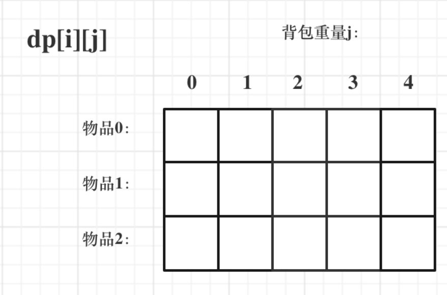
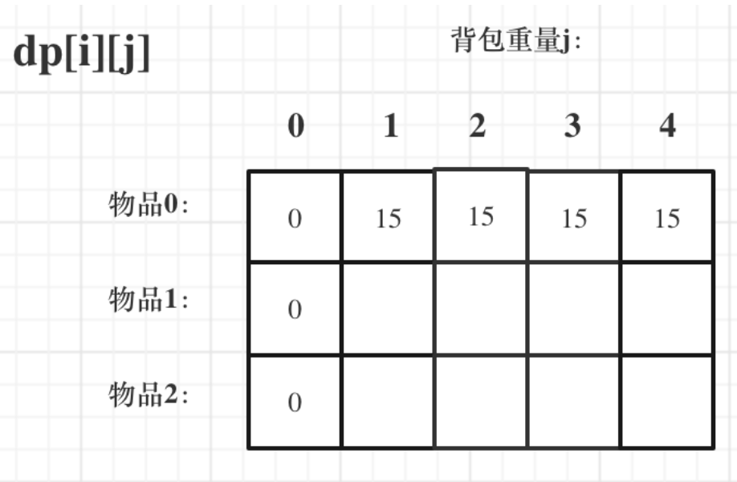

# 动态规划

## 何为动态规划

动态规划适用于解决具有多重重叠子问题的问题，其本质思想史根据迁移状态来推导出当前状态。解决动态规划问题主要有以下几个重要的步骤：

1. 确定dp[]数组的定义（下标的定义）
2. 确定dp数组的状态推导公式。
3. 初始化dp数组以及遍历顺序。

主要难点在于前两个，尤其是如何把待解决的问题转换到DP思想上（如何确定DP数组下标的定义），例如[正则表达式](https://leetcode-cn.com/problems/regular-expression-matching/)和[编辑距离](https://leetcode-cn.com/problems/edit-distance/)两个问题，需要经过复杂的推导才能确定DP数组的状态推导函数。以下部分会着重的讲述我在学习DP的过程中遇到的难题以及具体的推导的方法。


### [343. 整数拆分](https://leetcode-cn.com/problems/integer-break/submissions/) 

题目描述：**给定一个正整数 *n*，将其拆分为至少两个正整数的和，并使这些整数的乘积最大化。 返回你可以获得的最大乘积。**

第一步：定义dp数组。规定dp[i] 代表正整数i拆分后可以得到的最大乘积。

第二步：确定推导公式。直观上来看，dp[i] = max(dp[j] * dp[i-j])，j=1...i。在实现计算的过程中，我们使用两个for循环来计算：

```C++
int integerBreak(int n) {
        vector<int> dp(n + 1, 0);
        dp[1] = 1;
        dp[2] = 1;
        for(int i = 3; i <= n; i++)
        {
            for(int j = 0; j <= i;j++)
            {
                dp[i] = .....;
            }
        }
        return dp[n];
    }
```

使用这种方法计算时，**我们默认每一个dp[i]都是由至少两个dp[j]元素相乘得来，既每个dp[i]强制拆分成了至少4个数相乘，这样就忽略了两个数相乘和三个数相乘的情况**，因此，上述的dp推导公式是不正确的，正确的推导公式应该写成dp[i] = max(j * (i - j), j * dp[i-j]);这样就考虑了两个数相乘和三个数相乘的情况。

正确的代码应该写为：

```C++
class Solution {
public:
    int integerBreak(int n) {
        vector<int> dp(n + 1, 0);
        dp[1] = 1;
        dp[2] = 1;
        for(int i = 3; i <= n; i++)
        {
            for(int j = 0; j <= i;j++)
            {
                dp[i] = max(dp[i], max(j * dp[i-j], j * (i-j)));
            }
        }
        return dp[n];
    }
};
```


### [96. 不同的二叉搜索树](https://leetcode-cn.com/problems/unique-binary-search-trees/submissions/)

题目描述：**给你一个整数 `n` ，求恰由 `n` 个节点组成且节点值从 `1` 到 `n` 互不相同的 二叉搜索树 有多少种？返回满足题意的二叉搜索树的种数。**

第一步：定义dp数组下标。对于一个有i个节点的二叉树，我们定义dp[i]为可能的二叉树的个数。

第二步：确定dp推导公式。对于一个固定节点个数的二叉树，其可能的形状的个数为左子树可能的形状个数乘以右子树可能的形状个数。左子树和右子树个数和为i-1，故推导公式为：
$$
d p[i] = \sum{dp[j] * dp[i - j - 1]}, j = 0,1,2,...,i-1
$$
正确的代码为：

```C++
class Solution {
public:
    int numTrees(int n) {
        vector<int> dp(n+1, 0);
        dp[0] = 1;
        dp[1] = 1;
        for(int i = 2; i <= n; i++)
        {
            for(int j = 0; j < i; j++)
            {
                dp[i] += dp[j] * dp[i-j-1];
            }
        }
        return dp[n];
    }
};
```

## 0-1背包问题

问题描述：**有N件物品和一个最多能被重量为W 的背包。第i件物品的重量是weight[i]，得到的价值是value[i] 。每件物品只能用一次，求解将哪些物品装入背包里物品价值总和最大。**

直观想法：用暴力的方法，写一个回溯法的解决方案，每一个物品对应取和不取两种操作。但是这样操作的时间复杂度太高，是O(2^n)。

DP解法

1. 定义dp数组以及下表的意义：

   使用dp[i] [j]代表从0-i的物品中去取物品放进背包大小为j的背包中可以得到的最大的收益。 

   

2. 确定递推公式

   对于dp[i] [j],如果取第i个物品，则dp[i] [j]由dp[i-1] [j - weight[i]]确定：
   $$
   dp[i][j] = dp[i-1][j - weight[i]] + value[i]
   $$
   如果不取：
   $$
   dp[i][j] = dp[i-1][j]
   $$

3. 如何初始化dp数组

   首先，对于j = 0的情况，容量为0的背包无论如何无法放入物品，所以其价值为0；对于i = 0的情况，当j小于weight[0]时，由于无法放入第0号物品，因此应设置为0，当j大于等于weight[0]时，应设置为value[0]。

   其次，需要确定遍历的顺序，由以上的公式可以看出，dp[i] [j]是有位于上方和左上方的元素确定的，最好先遍历物品，再遍历背包重量。

   最终代码：

   ```C++
   // weight数组的大小 就是物品个数
   for(int i = 1; i < weight.size(); i++) 
   { // 遍历物品
       for(int j = 0; j <= bagWeight; j++) 
       { // 遍历背包容量
           if (j < weight[i]) 
           	dp[i][j] = dp[i - 1][j]; 
           else 
           	dp[i][j] = max(dp[i - 1][j], dp[i - 1][j - weight[i]] + value[i]);
   
       }
   }
   ```

   

### [416. 分割等和子集](https://leetcode-cn.com/problems/partition-equal-subset-sum/)

题目描述：**给你一个 只包含正整数 的 非空 数组 `nums` 。请你判断是否可以将这个数组分割成两个子集，使得两个子集的元素和相等。**

 此问题可以转化为0-1背包问题进行求解。是否可以划分为两个等和的子数组**等价于是否存在子数组的和等于数组所有元素总和的一半**。如果数组总和为奇数，直接返回false。

是否存在子数组总和为所有元素总和的一半是一个典型的背包问题，可以用DP解决该问题。

第一步：我们定义dp[i] [j]代表从0-i取物品，看是否总和可以等于j，这样我们最终的答案就是dp[n-1] [target]。

第二步：求解dp数组的推导公式，显然，对于dp[i] [j]，如果dp[i-1] [j]=1，说明前i-1个物品已经可以获得j的和了，dp[i] [j]也一定可以获得和为j。
$$
dp[i][j] = dp[i-1][j] \ \   if\ \  dp[i-1][j] = 1
$$
如果dp[i-1] [j]不等于1，则要看dp[i-1] [j - num[i]]是否为1，意思是如果钱i-1个数字可以构成总和j - num[i]的话，则到第i个物品时恰好取第i个物品可以构成总和j ，
$$
dp[i] [j] = dp[i-1][j - num[i]] \ \ \ if\ \ \  j >=num[i] 
$$
最终的代码为：

```c++
class Solution {
public:
    bool canPartition(vector<int>& nums) {
        int sum = 0;
        size_t n = nums.size();
        for(int num : nums)
            sum += num;
        if(sum % 2 == 1)
            return false;
        int target = sum / 2;
        vector<vector<int>> dp(n, vector<int>(target+1, 0));
        for(int i = 0; i <= target; i++)
            if(nums[0] == i)
                dp[0][i] = 1;
        for(int i = 1; i < n; i++)
        {
            for(int j = 1; j <= target; j++)
            {
                if(dp[i-1][j] == 1)
                    dp[i][j] = 1;
                else
                {
                    if(j >= nums[i])
                    {
                        dp[i][j] = dp[i-1][j - nums[i]] == 1 ? 1 : 0;
                    }
                    else
                        dp[i][j] = 0;
                }
            }
        }
        return dp[n-1][target];
    }
};
```

### [1049. 最后一块石头的重量](https://leetcode-cn.com/problems/last-stone-weight-ii/)

题目描述：

有一堆石头，用整数数组 stones 表示。其中 stones[i] 表示第 i 块石头的重量。

每一回合，从中选出任意两块石头，然后将它们一起粉碎。假设石头的重量分别为 x 和 y，且 x <= y。那么粉碎的可能结果如下：

​	如果 x == y，那么两块石头都会被完全粉碎；
​	如果 x != y，那么重量为 x 的石头将会完全粉碎，而重量为 y 的石头新重量为 y-x。
最后，最多只会剩下一块 石头。返回此石头 最小的可能重量 。如果没有石头剩下，就返回 0。

这道题其实也是可以转化成0-1背包问题。对于一堆石头，尽可能凑出等于重量总和一半的石头组合，这样就与题目416十分的相似。

第一步：定义dp数组的下标定义。定义dp[i] [j]表示前i个石头能否组成总和为j的组合。

第二步：定义数组迭代推导，对于dp[i] [j]， 如果j < stone[i]，说明放不下第i块石头，此时dp[i] [j] = dp[i-1] [j]。若果j >= stone[i]，说明可以放得下第i块石头，此时可以选择放或者不放，dp[i] [j] = dp[i-1] [j - stone[i]] || dp[i-1] [j]。

第三步：定义初始条件和遍历顺序，数组第一位从0....n一共n+1维，第二维从0...sum/2，最终返回dp[n] []中第二维最大的维数。

```C++
class Solution {
public:
    int lastStoneWeightII(vector<int>& stones) {
        int sum = accumulate(stones.begin(), stones.end(), 0);
        size_t n = stones.size();
        vector<vector<int>> dp(n + 1, vector<int>(sum / 2 + 1, 0));
        dp[0][0] = 1;
        for(int i = 0; i <= n; i++)
            dp[i][0] = 1;
        for(int i = 1; i <= n; i++)
        {
            for(int j = 1; j <= sum / 2;j++)
            {
                if(j < stones[i-1])
                {
                    dp[i][j] = dp[i-1][j];
                }
                else
                {
                    dp[i][j] = (dp[i-1][j] == 1 || dp[i-1][j - stones[i-1]] == 1) ? 1 : 0;
                }
            }
        }
        for(int j = sum / 2; j >= 0; j--)
            if(dp[n][j] == 1)
                return sum - 2 * j;
        return -1;
    }
};
```

### [494. 目标和](https://leetcode-cn.com/problems/target-sum/)

题目描述：给你一个整数数组 nums 和一个整数 target 。

向数组中的每个整数前添加 '+' 或 '-' ，然后串联起所有整数，可以构造一个 表达式 ：

例如，nums = [2, 1] ，可以在 2 之前添加 '+' ，在 1 之前添加 '-' ，然后串联起来得到表达式 "+2-1" 。
返回可以通过上述方法构造的、运算结果等于 target 的不同 表达式 的数目。

分析：我们令数组中符号为正的数字和为left，其余的和为right。left + right = sum，left - right = target。最终推导出right = （sum - target）/ 2.。此时，所有数字都是整数，故sum - target必须为偶数。同时，sum 必须大于等于target。这样，问题又归结成了0-1背包问题，看有多少种组合最终可以组成和为right = （sum - target）/ 2。

第一步：定义数组下标，对于dp[i] [j]规定为**前i个数字能组成和为j的组合的个数**。

第二步：确定推导公式，对于dp[i] [j]， 如果j <nums[i]，则dp[i] [j] = d[i-1] [j]。反之，dp[i] [j] = dp[i-1] [j] + dp[i-1] [j - nums[i]].

```C++
class Solution {
public:
    int findTargetSumWays(vector<int>& nums, int target) {
        int sum = accumulate(nums.begin(), nums.end(), 0);
        if((sum + target) % 2 == 1 || target > sum)
            return 0;
        int partial = (sum - target) / 2;
        size_t n = nums.size();
        vector<vector<int>> dp(n + 1, vector<int>(partial + 1, 0));
        dp[0][0] = 1;
        for(int i = 1; i <= n; i++)
        {
            for(int j = 0; j <= partial; j++)
            {
                dp[i][j] = dp[i-1][j];
                if(j >= nums[i-1])
                    dp[i][j] += dp[i-1][j - nums[i-1]];
            }
        }
        return dp[n][partial];
    }
};
```

### [122. 买卖股票的最佳时机2](https://leetcode-cn.com/problems/best-time-to-buy-and-sell-stock-ii/)

题目描述：

给定一个数组 prices ，其中 prices[i] 是一支给定股票第 i 天的价格。

设计一个算法来计算你所能获取的最大利润。你可以尽可能地完成更多的交易（多次买卖一支股票）。

第一步：定义dp数组的下标意义。对于dp数组，定义其为一个n*2的二维数组。dp[i] [0]表示第i天的时候持有股票所能获得的最大的收益，dp[i] [1]代表第i天的时候不持有股票获得的最大收益。

第二步：定义递推公式，对于第i天的行情，如果第i天不持有股票，那么可以是前一天持有今天卖出，也可以是前一天不持有今天也不持有的情况，所以dp[i] [1] = max(dp[i-1] [1], dp[i-1] [0] + prices[i]);如果第i天持有股票，那么可能前一天也持有今天继续持有，或者前一天不持有今天买入，dp[i] [0] = max(dp[i-1] [0]m dp[i-1] [1] - prices[i]).


代码：

```C++
class Solution {
public:
    int maxProfit(vector<int>& prices) {
        size_t n = prices.size();
        vector<vector<int>> dp(n, vector<int>(2, 0));
        dp[0][0] = -1 * prices[0];
        dp[0][1] = 0;
        for(int i = 1; i < n; i++)
        {
            dp[i][0] = max(dp[i-1][0], dp[i-1][1] - prices[i]);
            dp[i][1] = max(dp[i-1][1], dp[i-1][0] + prices[i]);
        }
        return max(dp[n-1][0], dp[n-1][1]);
    }
};
```

